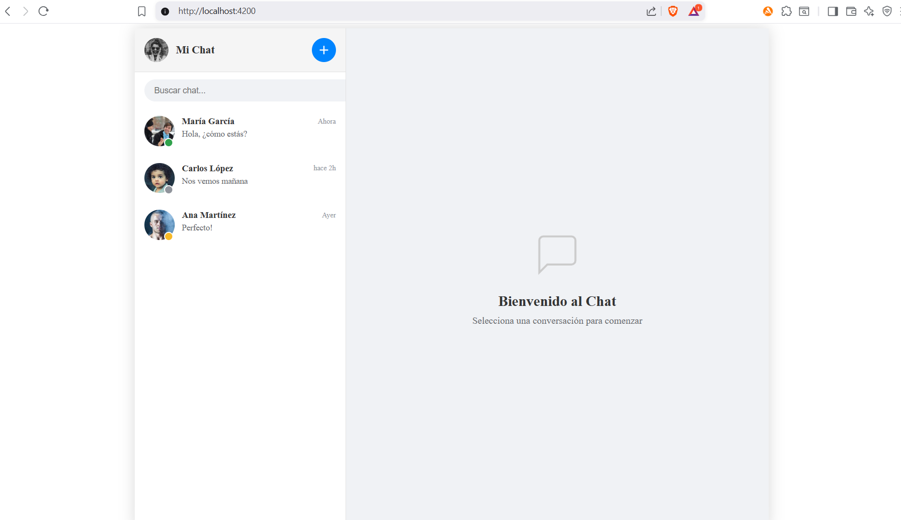
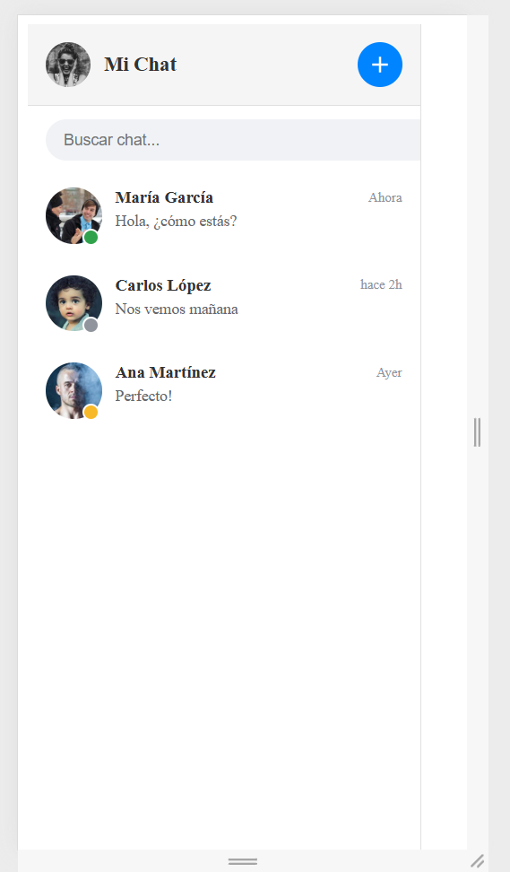
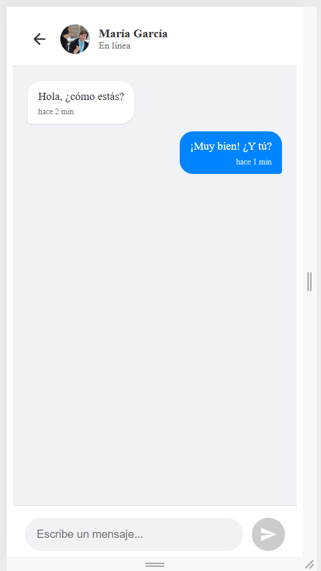

# Chat App – Trabajo Final Integrador (Angular)

Aplicación web tipo **chat** desarrollada con **Angular** como Trabajo Final Integrador de la materia *Desarrollo en Angular*.

El proyecto simula un sistema de chats con contactos, mensajes y respuestas automáticas, aplicando los conceptos centrales del framework.

---

## 🚀 Tecnologías utilizadas

- Angular (Standalone Components)
- TypeScript
- Angular Router
- Reactive Forms
- Signals
- CSS nativo (Flexbox / Responsive Design)
- GitHub
- Vercel

---

## 📌 Funcionalidades principales

- Lista de chats con contactos
- Buscador de chats
- Creación de nuevos chats
- Envío de mensajes
- Respuestas automáticas
- Diseño responsive (desktop y mobile)

---

## 🖼️ Capturas de pantalla

### Vista Desktop


### Vista Mobile – Panel de chats


### Vista Mobile – Conversación


---

## 🧭 Rutas

- `/chats`
- `/chats/:id`
- `/nuevo`

---

## ▶️ Ejecutar en local

```bash
npm install
ng serve
👨‍💻 Autor

Jorge Acosta
